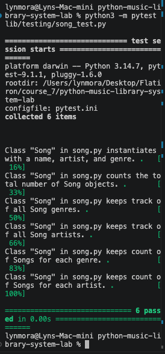

# Lab: Inheritance, Class Attributes, and Class Methods- Music Library System

Now that you’ve delved into creating class attributes and methods it is time to put these concepts to the test. In this lab our focus will be on a song class that will include several class attributes and methods.

## The Scenario

Imagine you've just landed a role as a junior software engineer at MusicTech Innovations, a cutting-edge company that powers a popular music streaming service. Your first project involves enhancing the company's music library system. The goal is to design a Python class that encapsulates the essential properties and behaviors of a song, making it easier for the team to manage and analyze the vast collection of tracks.
<br />
You're tasked with creating a Song class that not only represents individual songs with attributes like name, artist, and genre but also maintains global insights. For example, your class will keep track of the total number of songs, list all unique artists and genres, and even count how many songs belong to each genre and artist. This functionality is critical for features like personalized recommendations and data analytics.

## Tools & Resources

* [GitHub Repo](https://github.com/learn-co-curriculum/python-music-library-system-lab)
* [Python Documentation](https://docs.python.org/3/)
* [Classes - Python](https://docs.python.org/3/)
* [Python Class Attributes: An Overly Thorough Guide - Toptal](https://www.toptal.com/python/python-class-attributes-an-overly-thorough-guide)
* [Python's Instance, Class, and Static Methods Demystified - Real Python](https://realpython.com/instance-class-and-static-methods-demystified/)
* [The Factory Method Pattern and Its Implementation in Python - Real Python](https://realpython.com/factory-method-python/)

## Instructions

### Setup

Before we begin coding, let's complete the initial setup for this lesson: 
* Fork and Clone 
  * Go to the provided GitHub repository link.
  * Fork the repository to your GitHub account.
  * Clone the forked repository to your local machine.
* Open and Run File
  * Open the project in VSCode.
  * Run npm install to install all necessary dependencies.

### Task 1: Define the Problem

Build a song class. As a user, one should be able to:
* Build a song object
* See information about all songs
* Use methods that will add to the songs

### Task 2: Determine the Design

* Song
  * Attributes
    * name
    * artist
    * genre
  * Class Attributes
    *  count
    *  genres
    *  artists
    *  genre_count
    *  artists_count
  * Class Methods
    * add_song_to_count
    * add_to _genres
    * add_to_artists
    * add_to_genre_count
    * add_to_artists_count

### Task 3: Develop, Test, and Refine the Code

#### Step 1: Create a Feature Branch

```bash
git checkout -b [name of branch]
```

#### Step 2: Create song class

* ```__init__```:
  * name
  * artist
  * genre
* Class Attributes:
  * We need our Song class to be able to keep track of the number of songs that it creates
  * We need our Song class to be able to show us all of the artists of existing songs
  * We need our Song class to be able to show us all of the genres of existing songs
  * We also need our Song class to be able to keep track of the number of songs of each genre it creates
  * Ex:
    * {"Rap": 5, "Rock": 1, "Country": 3}
  * Lastly, we want our Song class to reveal to us the number of songs each artist is responsible for
  * Ex:
    * {"Beyonce": 17, "Jay-Z": 40}
  * count
  * genres
  * artists
  * genre_count
  * artists_count

#### Step 3: Class methods

* Each of the class methods should trigger upon the new song being created.
* add_song_to_count
  * Increments the value of count by one
* add_to _genres
  * Adds any new genres to a class attribute genres
  * Ensure there are only unique genres - no duplicates!
* add_to_artists
  * Adds any new artistes to a class attribute artists
  * Ensure there are only unique artists - no duplicates!
* add_to_genre_count
  * Updates class attribute genre_count
  * Increments genre key by 1, if genre doesn’t exist in genre_count add the key and set it to 1
* add_to_artists_count
  * Updates class attribute artists_count
  * Increments artists key by 1, if artist doesn’t exist in artists_count add the key and set it to 1

#### Step 4: Push feature branch and open a PR on GitHub

* Push the branch to GitHub
* Create a Pull Request (PR) on GitHub.

#### Step 5: Merge to main

* Merge the PR into main after review.
* Pull the new merged main branch locally and delete merged feature branch (optional)

### Task 4: Document and Maintain

Best Practice documentation steps:

* Add comments to code to explain purpose and logic
* Clarify intent / functionality of code to other developers
* Add screenshot of completed work included in Markdown in README.
* Update README text to reflect the functionality of the application following https://makeareadme.com. 
* Delete any stale branches on GitHub
* Remove unnecessary/commented out code
* If needed, update git ignore to remove sensitive data

## Implementation

The Song class in lib/song.py represents individual songs and maintains statistics across all songs created.

## Song Attributes

Each Song object contains:

name — the name of the song
artist — the artist who created the song
genre — the genre of the song

## Class Attributes

The Song class maintains the following information:

count — total number of Song objects created
genres — list of unique song genres
artists — list of unique artists
genre_count — dictionary containing the number of songs in each genre
artists_count — dictionary containing the number of songs associated with each artist

The implementation also supports artist_count to maintain compatibility with the provided test suite.

## Class Methods

The class provides methods that automatically update the class-wide statistics whenever a new Song object is created:

add_song_to_count() — increments the total song count
add_to_genres() — adds new genres while preventing duplicates
add_to_artists() — adds new artists while preventing duplicates
add_to_genre_count() — tracks the number of songs for each genre
add_to_artists_count() — tracks the number of songs for each artist
## Testing

The completed Song class was tested using the provided pytest test suite:

```
python3 -m pytest lib/testing/song_test.py
```


All 6 tests passed successfully.

Example

Creating three songs:

Song("99 Problems", "Jay Z", "Rap")
Song("Halo", "Beyonce", "Pop")
Song("Smells Like Teen Spirit", "Nirvana", "Rock")


produces class-wide information such as:

Song.count
#3

Song.genres
#['Rap', 'Pop', 'Rock']

Song.artists
#['Jay Z', 'Beyonce', 'Nirvana']

Song.genre_count
#{'Rap': 1, 'Pop': 1, 'Rock': 1}

Song.artist_count
#{'Jay Z': 1, 'Beyonce': 1, 'Nirvana': 1}

### Completed Work




## Save your work and push to GitHub

Before you submit your solution, you need to save your progress with git.
1. Add your changes to the staging area by executing ```git add ```.
2. Create a commit by executing ```git commit -m "Your commit message"```
3. Push your commits to GitHub by executing ```git push origin main``` or ```git push origin master```, depending on the name of your branch (use ```git branch``` to check on which branch you are).

## Submission and Grading Criteria

1. Use the rubric in Canvas as a guide for how this lab is graded.
2. Your submission will be automatically scored in CodeGrade, using the most recent commit. Remember to make sure you have pushed your commit to GitHub before submitting your assignment. 
3. You can review your submission in CodeGrade and see your final score in your Canvas gradebook.
4. When you are ready to submit, click the ***Load Lab: Object Oriented Programming (OOP)- Part 1- Bookstore*** button in Canvas to launch CodeGrade.
  * Click on + Create Submission. Connect your repository for this lab.
  * For additional information on submitting assignments in CodeGrade: [Getting Started in Canvas](https://help.codegrade.com/for-students/getting-started/getting-started-in-canvas)


